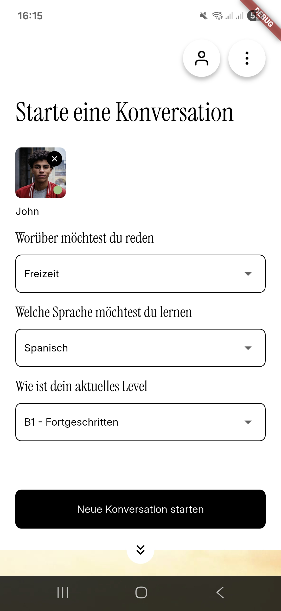

# TandemAi – AI-Powered Language Learning App

TandemAi helps you improve your language skills by chatting with an AI partner.  
Choose your **language**, **topic**, and **proficiency level**, and start practicing in a natural, interactive way. The ai chat partner will show mistakes.

## Design

| | |
|:---:|:---:|
|  |  |

## Features

- **AI Chat Partner** – Practice real conversations in multiple languages.  
- **Language Selection** – Switch between supported languages.  
- **Custom Topics** – Set the conversation theme.  
- **Language Level** – Adjust difficulty according to your skill level.  
- **API Key Management** – User-provided API key required for AI access.  
- **Multilingual Interface** – Currently available in **English** and **German**.  

## Tech Stack

- **Flutter** – Cross-platform UI framework  
- **Flutter Bloc** – State management  
- **GoRouter** – Navigation  
- **Feature-Driven Architecture** – Clean separation of features  
- **L10n** – Built-in localization support  

## Architecture Overview
Feature-Driven Design – Each feature (Chat, Profile, About) is self-contained.

Chat – Starts in chat_settings (Create new chat, switch chat, etc) → launches ai_chat (The actual chat).

Profile – Allows entering & saving API key.

About – Displays legal information.

Shared – Common widgets & utilities.
